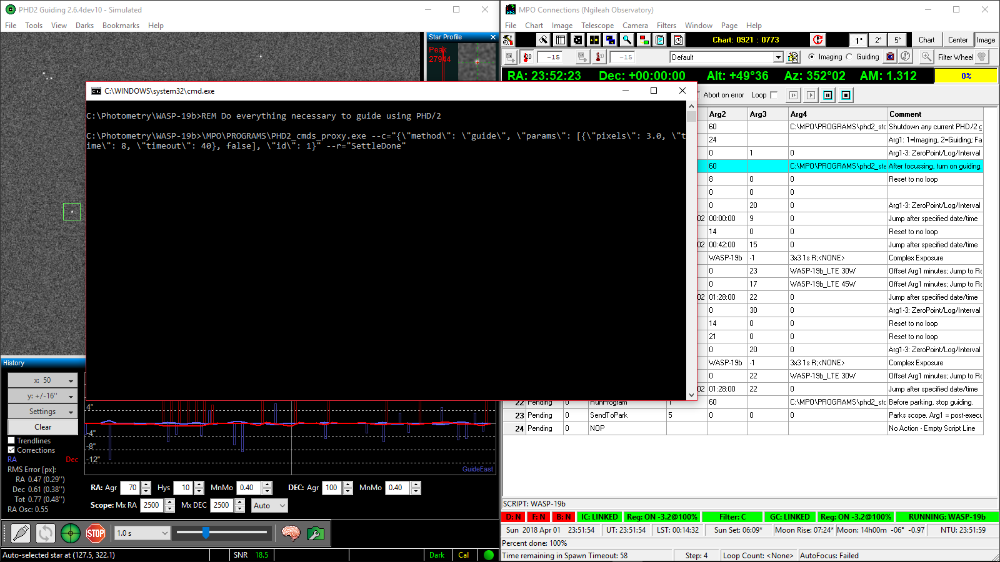

# PHD2_cmds_proxy
Send PHD/2 commands over TCPIP using the [PHD/2 json protocol](https://github.com/OpenPHDGuiding/phd2/wiki/EventMonitoring)

## Rationale

Fundamentally to be able to use PHD/2 from clients that can call other programs with parameters but cannot be modified to send commands over a custom TCP/IP socket as PHD/2 requires.

## Usage

```
Usage: PHD2_cmds_proxy {--verbose|help} [--command="json string" {--response="regex to match json string response"}] {--host=hostname {--port=number}}
Send commands over TCP/IP to PHD/2 and optionally handle responses.

Options:
  -v, --verbose              Get extra spammy output including step by step
                               logging of communications.
  -c, --command=VALUE        Quoted json command to send verbatim to PHD/2.
                               --response is optional with --command.
  -r, --response=VALUE       Regular expression that matches json response
                               from PHD/2 that indicates the command is done.
                               Requires --command be specified.
  -h, --host=VALUE           Optional host to connect to. Default is localhost
                               if none specified.
  -p, --port=VALUE           Optional port on host to connect to. Default is
                               port 4400 if none specified.
  -?, --help                 Display this help.
```

## Examples of invocation.

Incidentally these are the things I suspect you are most likely to want to do.

1. Stop PHD/2 doing all the things.

```
PHD2_cmds_proxy.exe --c={\"method\":\"stop_capture\"}
```

Note: There is no response to wait for when telling PHD/2 to stop capture.

2. Tell PHD/2 to do everything it must to start guiding.

```
PHD2_cmds_proxy.exe --v --c="{\"method\": \"guide\", \"params\": [{\"pixels\": 1.5, \"time\": 8, \"timeout\": 40}, false], \"id\": 42}" --r="SettleDone"
```

This example will cause PHD/2 to start looping, attempt to find a guide star, calibrate if it must and commence guiding. We wait for a response that contains the string "SettleDone" to tell us for good or bad that PHD/2 is done.

## Cloning.

Clone with --recursive as there is a single submodule to pull in as well.

```
git clone --recursive https://github.com/NgileahObservatory/PHD2_cmds_proxy.git
```

## Building.

In Visual Studio, open the solution file (.sln). Build. Job done.

## Example use with a third party application.

[MPO Connections](http://www.minorplanetobserver.com/MPOSoftware/MPOConnections.htm) has powerful scripting capabilities. It can run other programs from its scripts but command line parameters are limited to 20 characters.

My setup has batch files to invoke PHD2_cmds_proxy with all the parameters necessary. These are called from MPO Connections and allow connections to start and stop guiding as necessary.


_Figure 1. MPO Connections controlling external guiding. PHD/2 running simulated camera and mount._

This makes the following possible.

 1. Connections slews to target.
 2. Autofocus.
 3. Plate solve target field.
 4. Command PHD/2 to commence guiding.
 5. Image the target for whatever length of time or number of images.
 6. Command PHD/2 to cease guiding.
 7. Slew to the next target and repeat steps 2 through 6.

This will result in more targets imaged and more sleep obtained!
